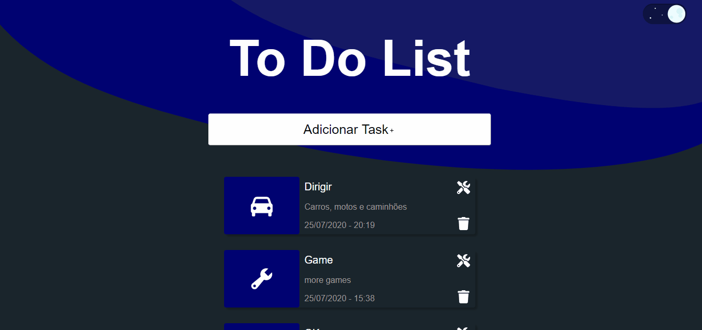

<h1 align="center">To Do List</h1>
<p align="center">Uma simples lista de tarefas feita em reactjs</p>
<h1 align="center">
    <a href="https://pt-br.reactjs.org/">🔗 React</a>
</h1>


<div align="center">
    
</div>

### 🎲 Rodando em sua máquina

```bash
# Clone o repositório do backend
$ git clone <https://github.com/JonathanAllisson/CRUD-To-Do-List-Back>

# Acesse a pasta do projeto no terminal/cmd
# Vá para a pasta server
# Instale as dependências
$ npm install ou yarn

# Execute a aplicação em modo de desenvolvimento
$ npm run dev ou yarn dev

# O servidor inciará na porta:3333 - acesse <http://localhost:3333>

# Repita o processo com este repositório e acesse <http://localhost:3000>
```


### 🛠 Tecnologias

As seguintes ferramentas foram usadas na construção do projeto:

- [React](https://pt-br.reactjs.org/)
- [Styled-Components](https://styled-components.com/)
- [axios](https://github.com/axios/axios)
- [Formik](https://formik.org/docs/overview)
